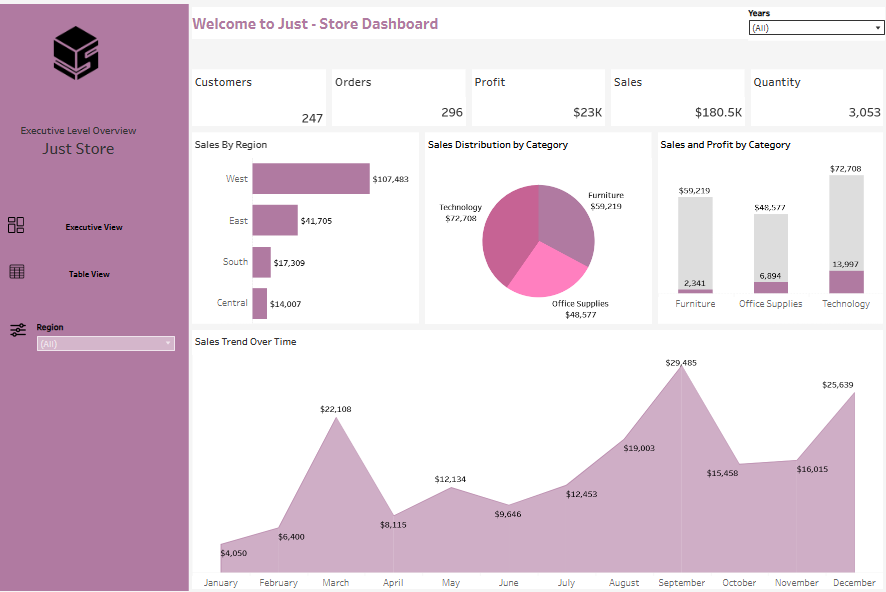
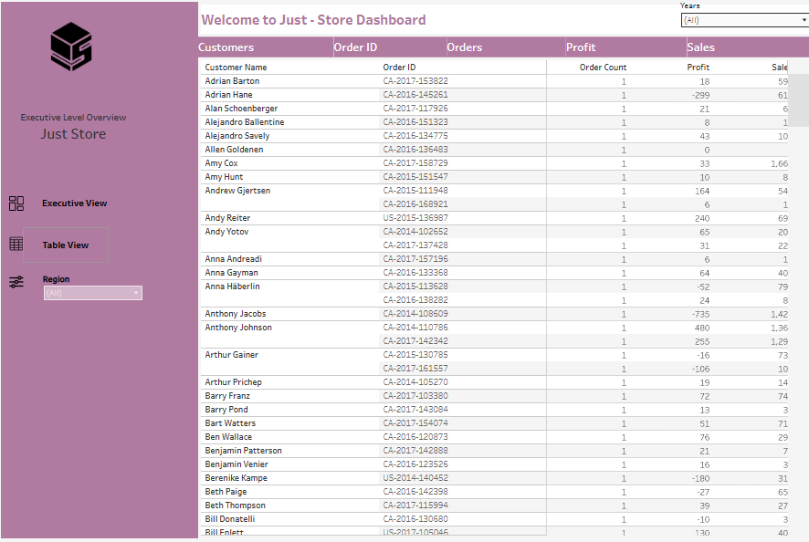

# Just Store Sales Analytics | Tableau

## Project Overview
This project presents an interactive Tableau dashboard designed to analyze retail sales performance and provide a clear executive-level view of key business metrics. The dashboard allows users to explore customer activity, orders, profit, sales, quantity, regional performance, product categories, and monthly sales trends.

## Dashboard Preview

## Key Performance Indicators
- Total Customers: 247
- Total Orders: 296
- Total Profit: $23K
- Total Sales: $180.5K
- Total Quantity Sold: 3,053

## Analysis Performed
The dashboard analyzes:
- Sales performance by region
- Sales distribution by product category
- Sales and profit by category
- Monthly sales trends
- Customer and order-level transactions
- Regional performance using an interactive filter

## Key Insights
- The West region generated the highest sales at approximately $107K.
- Technology generated the highest category sales at approximately $72.7K.
- Furniture generated approximately $59.2K in sales.
- Office Supplies generated approximately $48.6K in sales.
- Monthly sales fluctuated throughout the year, with notable peaks in March, September, and December.

## Table View

The table view provides transaction-level details, including customers, order IDs, order counts, profit, and sales.

## Tools Used
- Tableau Public
- Data Visualization
- Dashboard Design
- Data Analysis
- Interactive Filtering

## Interactive Dashboard
View the interactive Tableau dashboard here:

[View Dashboard on Tableau Public](https://public.tableau.com/views/JustStoreSalesAnalyticsDashboard/ExecutiveView?:language=en-US&publish=yes&:sid=&:redirect=auth&:display_count=n&:origin=viz_share_link)

## Project Files
- `Just - Store - Sales - Analytics.twbx` . Tableau packaged workbook
- `Just-Store-Sales_Dashboard.png` . Executive dashboard preview
- `Just-Store-Table-View.png` . Detailed table view

